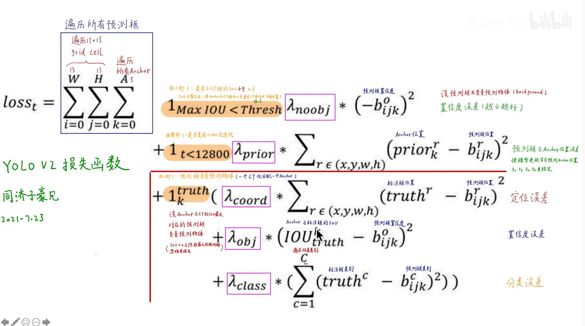

1.Batch Normalization:帮助收敛+正则

2.High Resolution Classifier:高分辨率分类器 448*448*3 	10 epoch 高分辨率下分类分类器 目标检测下再训练

3.Convolutional With Anchor Boxes:
yolov1:x y w h 可以野蛮生长 产生漂移
anchor:5个聚类产生的box x y 固定在grid中 输出对于anchor的偏移量
416*416*3 ——> 13*13*5*25 (tx ty tw th c 20 class)

提高recall = TP/(TP+FN) 	事件中 正确预测结果占的利弊
降低precision = TP/(TP+FN)  预测中 正确预测结果占的比例 后处理提高precision

4.Dimension Cluster: 聚类获取Anchor k-means聚类 Euclidean->IOU
			d = 1-IOU(box,centriod)

5.Direct location prediction:限制偏移量生长
yolov1
x = X_output*W_anchor + X_anchor
y = Y_output*W_anchor + Y_anchor
yolov2 预测相对于grid cell的坐标 中心一定在grid cell中
x = sigmod(X_output) + X_anchor
y = sigmod(Y_output) + Y_anchor
w = W_anchor*e**(W_ouput)
h = H_anchor*e**(H_ouput)

grid cell 归一化为1 0-1+坐标W/H*正数

6.Fine-Grained Features:细粒度特征
13*13   26*26*512 1*1 conv->26*26*64->拆分13*13*256
		26*26*512 —>13*13*2048
		特征拼接
		提升不高 1%

7.multi-scale Traning
yolov1  448
yolov2  416*416 不固定尺寸大小 每十个batch换一个尺寸 320-608 resize network

GLOBAL AVGPOOL 适应所有尺寸 一个channel一个数

8.Further Experiments:其他测试集

FASTER-darknet-19 19个卷积层 5个池化层

1.训练图像分类模型
2.训练图像检测模型 1000class 分类
去掉最后一层卷据层 新增一层3*3的卷积层 + 1*1卷积层 -> 输出13*13*5*25

