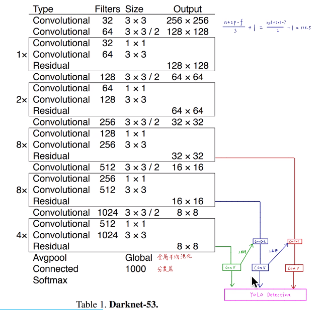
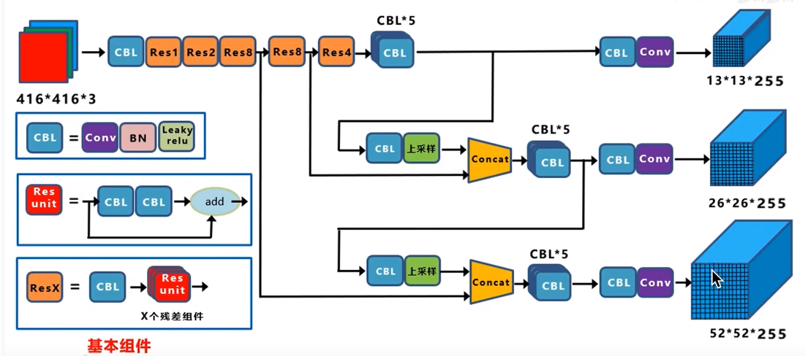
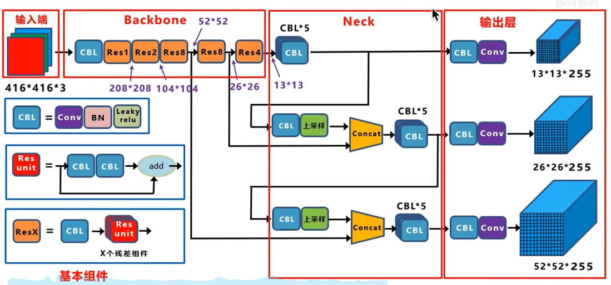
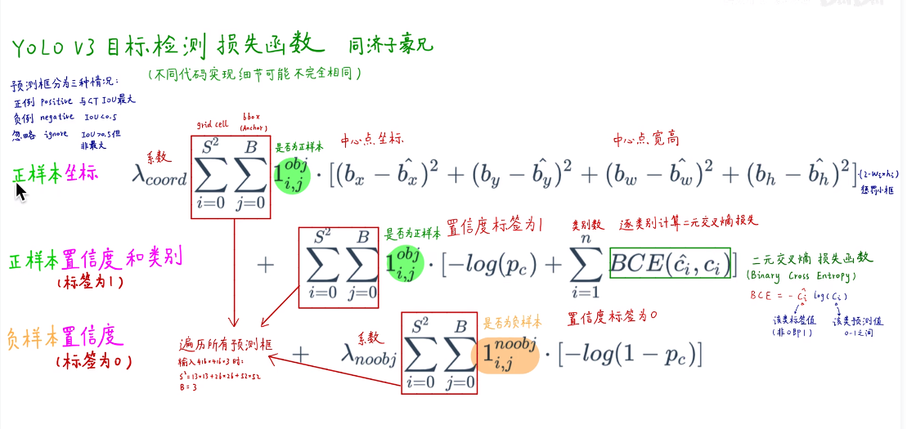

```angular2html
backbone:darknet 53
conv 3*3 32->256*256
conv 3*3 64->128*128

conv 1*1
conv 3*3
residual	128*128

conv 3*3	64*64

conv 1*1
conv 3*3
residual	64*64

conv 3*3	32*32

8 *
conv 1*1
conv 3*3
residual  	32*32

conv 3*3	16*16

8*
conv 1*1
conv 3*3
residual	16*16

conv 3*3	8*8

4*
conv 1*1
conv 3*3
residual	8*8

avgpool
connect
softmax
```



```angular2html
13*13*255
255 = 3 anchor * (5 x y w h c + 80 class)


416*416*3->
13*13*255 大尺度
26*26*255 中尺度
52*52*255 小尺度

N*N*255

全卷积层
```
## 损失函数


## github
https://github.com/ultralytics/yolov3
