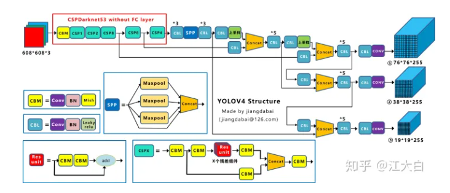
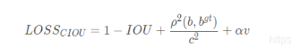
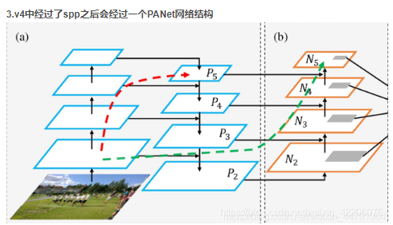

DarkNet53->CspDarkNet53


```angular2html

```
CIOU


```angular2html
iou + 中心点位置 + 长宽
```

```angular2html
1.特征提取网络的不同
2.激活函数的不同
3.loss的不同
4.数据处理的不同 mosaic 照片堆叠
5.学习率的不同 学习率余弦退火衰减
lr_schedule = tf.keras.experimental.CosineDecayRestarts(
    initial_learning_rate = learning_rate_base, 
    first_decay_steps = 5*epoch_size, 
    t_mul = 1.0,
    alpha = 1e-2
)
```
SPP
```angular2html
maxpool1 = MaxPooling2D(pool_size=(13, 13), strides=(1, 1), padding='same')(P5)
maxpool2 = MaxPooling2D(pool_size=(9, 9), strides=(1, 1), padding='same')(P5)
maxpool3 = MaxPooling2D(pool_size=(5, 5), strides=(1, 1), padding='same')(P5)
P5 = Concatenate()([maxpool1, maxpool2, maxpool3, P5])
```
PANet

```angular2html
在yolov3中，由darknet53得到的（13,13,1024）的feature map经过两次上采样，途中与（26,26,512）和（52,52,256）进行concat。
在yolov4中，不仅有特征金字塔结构，还有下采样的操作。由spp之后先经过三次conv，然后喂进PANet，先经过两次上采样，然后再经过两次下采样，途中进行特征融合，得到预测的三个head。
```
激活函数
```angular2html
计算公式：Mish = x*tanh(ln(1+e^x))
```

loss
```angular2html
yolov3#################################################################################################################
yolov3中对于正样本的预测框的位置loss计算代码
# pos_samples 只有在正样本的地方取值为1.，其它地方取值全为0.
pos_objectness = label_objectness > 0
pos_samples = fluid.layers.cast(pos_objectness, 'float32')
pos_samples.stop_gradient=True

#从output中取出所有跟位置相关的预测值
tx = reshaped_output[:, :, 0, :, :]
ty = reshaped_output[:, :, 1, :, :]
tw = reshaped_output[:, :, 2, :, :]
th = reshaped_output[:, :, 3, :, :]

# 从label_location中取出各个位置坐标的标签
dx_label = label_location[:, :, 0, :, :]
dy_label = label_location[:, :, 1, :, :]
tw_label = label_location[:, :, 2, :, :]
th_label = label_location[:, :, 3, :, :]
# 构建损失函数
loss_location_x = fluid.layers.sigmoid_cross_entropy_with_logits(tx, dx_label)
loss_location_y = fluid.layers.sigmoid_cross_entropy_with_logits(ty, dy_label)
loss_location_w = fluid.layers.abs(tw - tw_label)
loss_location_h = fluid.layers.abs(th - th_label)

# 计算总的位置损失函数
loss_location = loss_location_x + loss_location_y + loss_location_h + loss_location_w

# 乘以scales
loss_location = loss_location * scales
# 只计算正样本的位置损失函数
loss_location = loss_location * pos_samples

分别找到模型输出的预测框的tx，ty，tw，th，然后与基于真实框得到的label的tx，ty，tw，th进行交叉熵损失函数的构建，最后进行相加。

yolov4#################################################################################################################
#-----------------------------------------------------------#
#   真实框越大，比重越小，小框的比重更大。
#-----------------------------------------------------------#
box_loss_scale = 2 - y_true[l][...,2:3]*y_true[l][...,3:4]

#-----------------------------------------------------------#
#   计算Ciou loss
#-----------------------------------------------------------#
raw_true_box = y_true[l][...,0:4]
ciou = box_ciou(pred_box, raw_true_box)
ciou_loss = object_mask * box_loss_scale * (1 - ciou)

在v4中是使用（1-CIOU）直接作为正样本的位置损失函数。
```