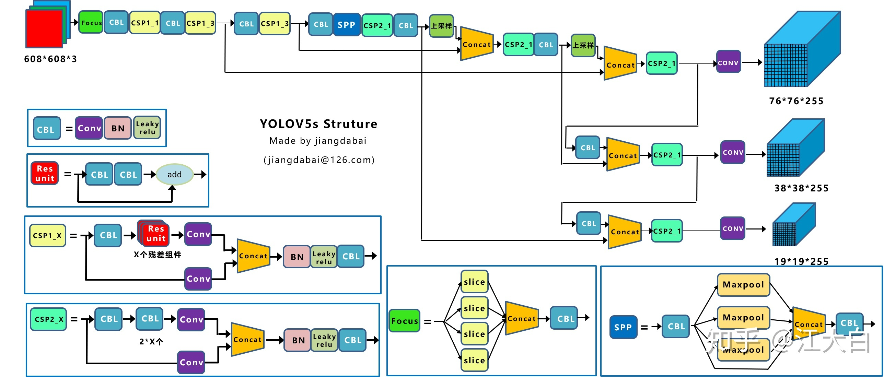
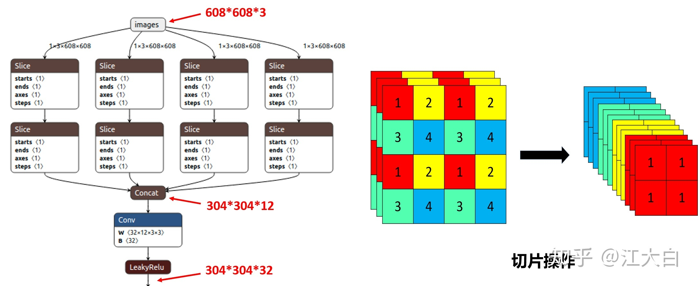
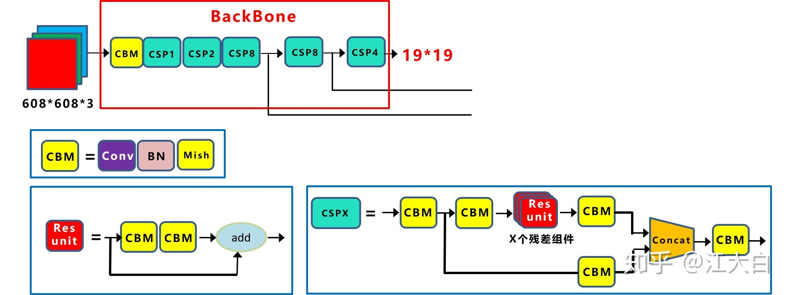
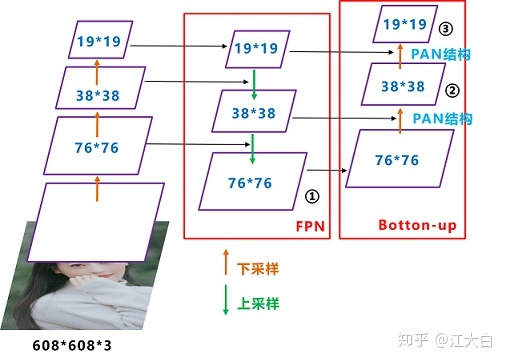
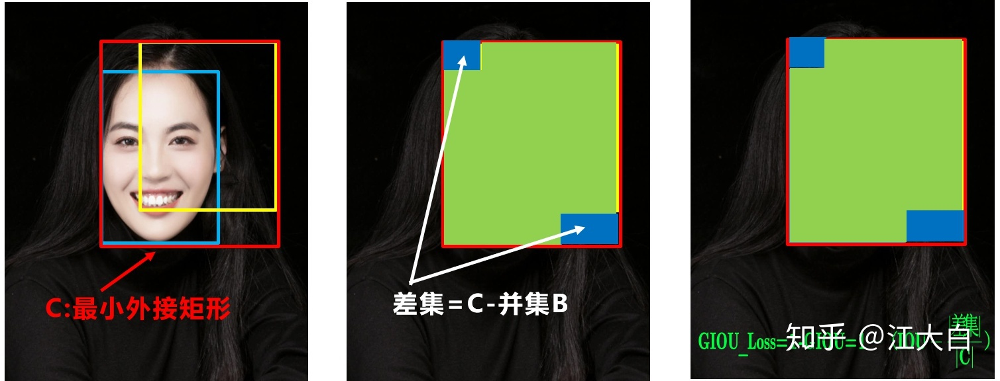
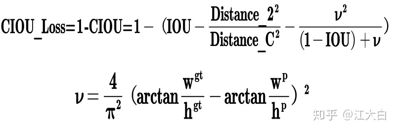

结构 


自适应锚框计算

自适应图片缩放
```angular2html
通过这种简单的改进，推理速度得到了37%的提升，可以说效果很明显
```

### Backbone
Focus结构  

CSP结构

Neck

```angular2html
Yolov4的Neck结构中，采用的都是普通的卷积操作。而Yolov5的Neck结构中，采用借鉴CSPnet设计的CSP2结构，加强网络特征融合的能力
```
LOSS


```angular2html
Yolov5中采用其中的CIOU_Loss做Bounding box的损失函数。
```
NMS
```angular2html
Yolov4在DIOU_Loss的基础上采用DIOU_nms
Yolov5中采用加权nms的方式
```